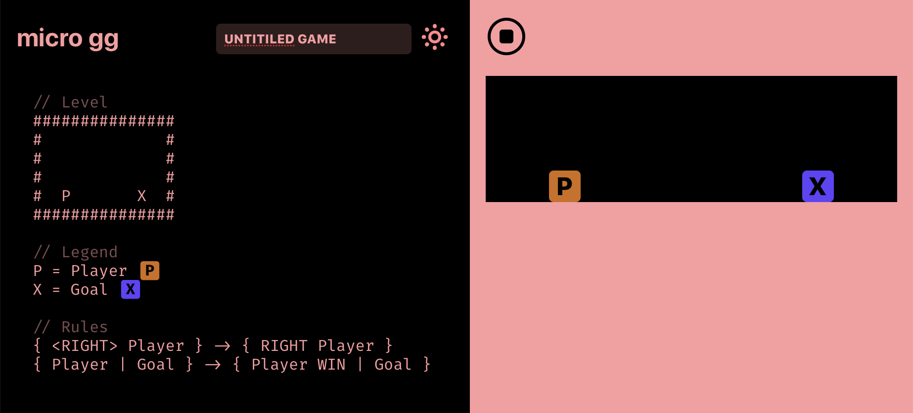

# Micro gg

Micro gg is a simple rules based language for making realtime games.

Use it online here: <https://waynetron.github.io/micro-gg>


## How does it work?

Let's break down a super simple example.



# Level
```
###############
#             #
#             #
#  P       X  #
###############
```
Levels are drawn with ascii.


# Legend
```
P = Player
X = Goal
```

This lets the game know which keywords map to which ascii characters in our level above.

The ascii characters and keywords you use aren't limited to those in the examples and could be anything. Eg: ```@ = NicolasCage```


# Rules
Rules define how the game world works. They consist of a left state and a right state separated by an arrow.
If the state on the left is matched, it is replaced with the state on the right.

``` { <RIGHT> Player } -> { RIGHT Player } ```

```<RIGHT>``` (with the brackets) is an input and ```RIGHT``` (without the brackets) is a movement.

So what this rule is saying is: If you press right, the player will move to the right.

```
{ Player | Goal } -> { Player WIN | Goal }
```
The pipe character ```|``` represents touching

What this rule is saying is: If a Player is touching a Goal. Then that Player wins.

That's close to the simplest possible thing you can make with Micro gg.

There are a bunch of examples within the app under the 'examples' menu. This is really the only way to explore the various language features and learn what is possible at this time.